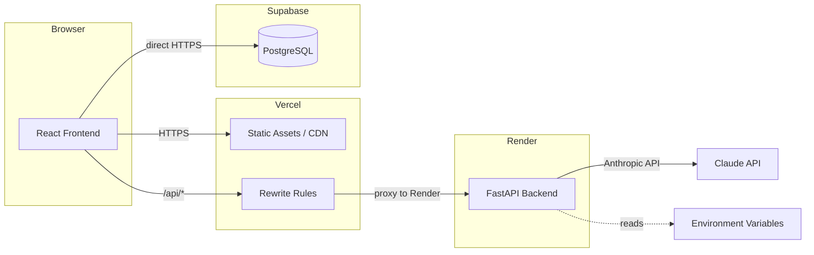
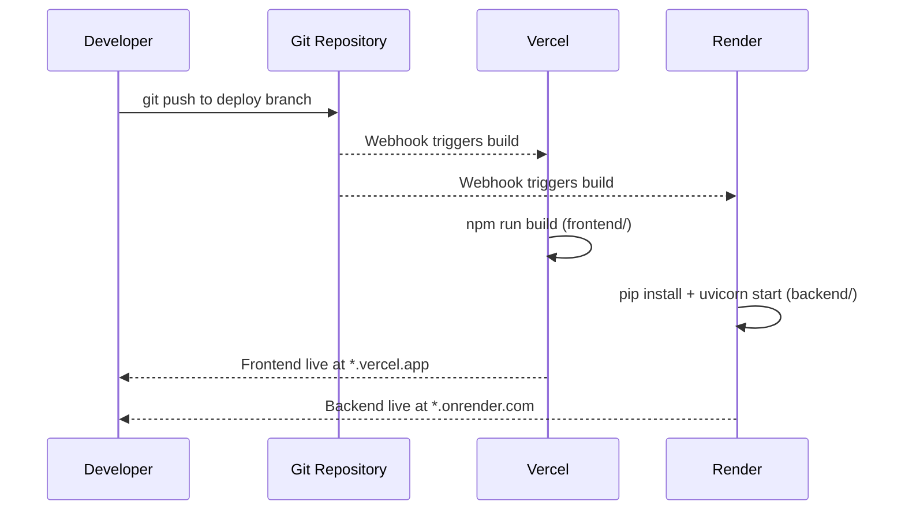

# Design Document: CirKit Deployment

## Overview

This design covers deploying the CirKit application to production with three services:

- **Frontend** → Vercel (static site with serverless rewrites)
- **Backend** → Render free tier (Python web service)
- **Database** → Supabase (existing hosted PostgreSQL)

The architecture uses Vercel's rewrite rules as an API proxy so the frontend never needs to know the backend URL directly. All API calls from the browser go to `/api/*` on the Vercel domain, which Vercel forwards to the Render backend. This eliminates CORS issues for the primary flow and keeps the backend URL out of client-side code.

The backend still configures CORS as a defense-in-depth measure — if any client bypasses the proxy (e.g., direct API testing, mobile clients in the future), CORS headers control access.

### Key Design Decisions

1. **Vercel rewrites as API proxy** rather than direct backend calls from the browser. This simplifies CORS, keeps the Render URL private, and makes the frontend environment-agnostic.
2. **Environment-driven CORS origins** so the backend can be updated without code changes when new frontends or domains are added.
3. **Startup validation for required secrets** — the backend refuses to start if `ANTHROPIC_API_KEY` is missing, failing fast rather than erroring on first request.
4. **Single hardcoded URL fix** — only `RunPanel.jsx` has a hardcoded `http://localhost:8000/generate-code` URL. All other frontend components already use `/api/*` relative paths.

## Architecture



### Request Flow

1. User visits `https://<app>.vercel.app` → Vercel serves the built React SPA
2. Frontend makes API calls to `/api/chat`, `/api/generate-code`, `/api/upload-pdf`
3. Vercel rewrite rules match `/api/:path*` and proxy to `https://<app>.onrender.com/:path*`
4. Backend processes the request, calls Claude API if needed, returns response
5. Frontend reads/writes project data directly to Supabase via the JS client

### Deployment Flow



## Components and Interfaces

### 1. Vercel Configuration (`frontend/vercel.json`)

Defines rewrite rules for API proxying and SPA routing.

```json
{
  "rewrites": [
    { "source": "/api/:path*", "destination": "https://<RENDER_BACKEND_URL>/:path*" },
    { "source": "/(.*)", "destination": "/index.html" }
  ]
}
```

**Design rationale**: API rewrites are listed before the SPA catch-all so `/api/*` requests are proxied to Render and never hit the SPA fallback. The actual Render URL is configured once here and nowhere else in the frontend code.

### 2. Vite Dev Server Proxy (`frontend/vite.config.js`)

Already configured. Forwards `/api/*` to `http://localhost:8000` with the `/api` prefix stripped, matching the production rewrite behavior.

```js
server: {
  proxy: {
    '/api': { target: 'http://localhost:8000', rewrite: (p) => p.replace(/^\/api/, '') }
  }
}
```

No changes needed — this already works correctly for local development.

### 3. Frontend API Call Fix (`frontend/src/components/RunPanel.jsx`)

The single hardcoded URL that needs to change:

```diff
- const res = await fetch('http://localhost:8000/generate-code', {
+ const res = await fetch('/api/generate-code', {
```

All other frontend components (`ChatPanel.jsx`, `PDFUpload.jsx`, `RunPanel.jsx`'s `generateCanvas` function) already use `/api/*` relative paths.

### 4. Backend CORS Configuration (`backend/main.py`)

Replace the permissive `allow_origins=["*"]` with environment-driven origins:

```python
import sys

# Startup validation
api_key = os.getenv("ANTHROPIC_API_KEY")
if not api_key:
    print("ERROR: ANTHROPIC_API_KEY environment variable is not set", file=sys.stderr)
    sys.exit(1)

ai = anthropic.Anthropic(api_key=api_key)

# CORS configuration
allowed_origins_str = os.getenv("ALLOWED_ORIGINS", "http://localhost:5173,http://localhost:4173")
allowed_origins = [o.strip() for o in allowed_origins_str.split(",") if o.strip()]

app.add_middleware(
    CORSMiddleware,
    allow_origins=allowed_origins,
    allow_methods=["*"],
    allow_headers=["*"],
)
```

**Design rationale**: 
- `ALLOWED_ORIGINS` defaults to local dev origins so existing local workflows don't break.
- In production on Render, set `ALLOWED_ORIGINS` to include the Vercel production domain.
- The wildcard `*` is removed to enforce origin restrictions in production.
- Startup validation for `ANTHROPIC_API_KEY` ensures the service fails fast with a clear error rather than returning 500s on first API call.

### 5. Backend Health Endpoint

Already exists at `GET /health` returning `{"status": "ok"}`. No changes needed. Render uses this for health checks.

### 6. Environment Variables

| Variable | Service | Where Set | Purpose |
|---|---|---|---|
| `VITE_SUPABASE_URL` | Vercel (build-time) | Vercel Dashboard → Environment Variables | Supabase project URL |
| `VITE_SUPABASE_ANON_KEY` | Vercel (build-time) | Vercel Dashboard → Environment Variables | Supabase anonymous key |
| `ANTHROPIC_API_KEY` | Render (runtime) | Render Dashboard → Environment | Claude API key |
| `ALLOWED_ORIGINS` | Render (runtime) | Render Dashboard → Environment | Comma-separated allowed CORS origins |
| `PORT` | Render (runtime) | Auto-set by Render | Port for uvicorn to bind |

### 7. Render Service Configuration

| Setting | Value |
|---|---|
| Name | `cirkit-backend` |
| Environment | Python 3 |
| Region | Oregon (US West) or closest to Supabase region |
| Branch | deployment branch |
| Root Directory | `backend` |
| Build Command | `pip install -r requirements.txt` |
| Start Command | `uvicorn main:app --host 0.0.0.0 --port $PORT` |
| Plan | Free |

### 8. Vercel Project Configuration

| Setting | Value |
|---|---|
| Framework Preset | Vite |
| Root Directory | `frontend` |
| Build Command | `npm run build` |
| Output Directory | `dist` |
| Node.js Version | 18.x |

## Data Models

No new data models are introduced. The existing Supabase schema remains unchanged:

- **`projects`** table: `id` (uuid PK), `name` (text), `circuit` (jsonb), `created_at` (timestamptz), `updated_at` (timestamptz)
- **`chat_messages`** table: `id` (uuid PK), `project_id` (uuid FK → projects), `role` (text), `content` (text), `created_at` (timestamptz)
- **Index**: `idx_chat_messages_project` on `chat_messages(project_id, created_at)`
- **RLS**: Enabled on both tables with permissive policies

The migration at `supabase/migrations/001_create_tables.sql` must be verified as applied before going live.

## Error Handling

### Backend Startup Errors

| Condition | Behavior |
|---|---|
| `ANTHROPIC_API_KEY` not set | Log error to stderr, exit with code 1 |
| `ALLOWED_ORIGINS` not set | Default to `http://localhost:5173,http://localhost:4173` (dev-safe) |
| `PORT` not set | Uvicorn defaults to 8000 (Render always sets this) |

### Runtime Errors

| Condition | Behavior |
|---|---|
| Backend unreachable from Vercel proxy | Vercel returns 502/504 to the browser |
| Frontend receives non-200 from `/api/*` | Components display inline error messages (already implemented in ChatPanel and RunPanel) |
| CORS rejection (disallowed origin) | Browser blocks the response; no CORS headers returned |
| Anthropic API key invalid | Backend returns 500; frontend shows error message |

### Build Pipeline Errors

| Condition | Behavior |
|---|---|
| `npm run build` fails | Vercel marks deployment as failed, previous version stays live |
| `pip install` fails | Render marks deployment as failed, previous version stays live |

## Testing Strategy

Property-based testing is **not applicable** for this feature. The deployment work is infrastructure configuration (Vercel rewrites, Render service setup, CORS middleware, environment variables). There are no pure functions with meaningful input variation to test with PBT. The appropriate testing strategies are:

### Manual Smoke Tests (Post-Deployment)

These verify the end-to-end deployment is functional:

1. **Frontend loads**: Visit production URL → CirKit landing page renders
2. **SPA routing works**: Navigate to `/app` → Main layout renders without 404
3. **API proxy works**: Send a chat message → Response appears in chat panel
4. **Code generation works**: Generate code for a circuit → Arduino code appears in editor
5. **Health check**: `GET https://<backend>.onrender.com/health` → `{"status": "ok"}`
6. **CORS enforcement**: `curl` from disallowed origin → No CORS headers in response

### Pre-Deployment Verification Checklist

1. **Hardcoded URL audit**: `grep -r "localhost:8000" frontend/src/` returns zero results
2. **Build succeeds locally**: `cd frontend && npm run build` exits 0
3. **Backend starts locally**: `cd backend && uvicorn main:app` starts without errors
4. **Database schema verified**: Query Supabase to confirm `projects` and `chat_messages` tables exist with correct columns
5. **Environment variables documented**: `.env.example` files are up to date for both frontend and backend

### Automated Build Verification

Both Vercel and Render automatically fail deployments if the build step exits non-zero. This provides a basic CI gate without additional configuration:

- Vercel: `npm run build` must succeed
- Render: `pip install -r requirements.txt` must succeed

### What's NOT Tested Automatically

- HTTPS enforcement (provided by Vercel and Render platforms)
- Render free-tier cold start behavior (first request after idle may be slow)
- Supabase connectivity from the browser (depends on correct env vars in Vercel)
