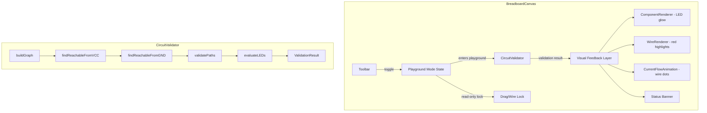
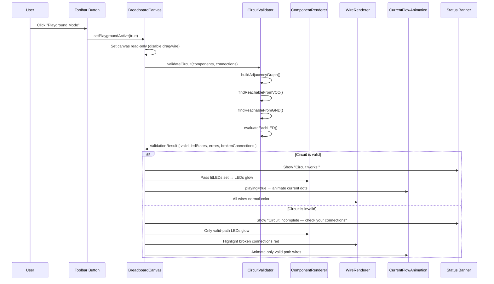
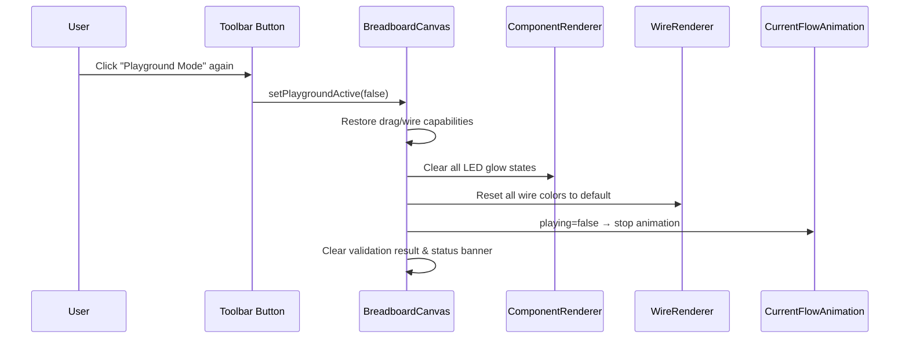

# Design Document: Playground Mode

## Overview

Playground Mode is a simulation feature that lets users test whether their circuit works in real time without physical hardware. When activated via a toolbar button, the system evaluates the circuit JSON, validates that all components have complete paths from VCC to GND, and provides visual feedback — lighting up LEDs that have valid paths, animating current flow along valid wires, and highlighting broken connections in red.

The feature is entirely frontend-based. It introduces a new `playground` canvas mode that makes the board read-only, a graph-based circuit validator that performs reachability analysis, and visual enhancements to ComponentRenderer and WireRenderer to reflect validation results. The existing `CurrentFlowAnimation` component is reused for wire animation, while LED glow effects are added as Konva shadow/opacity changes on the LED dome shape.

## Architecture



## Sequence Diagrams

### Entering Playground Mode



### Exiting Playground Mode



## Components and Interfaces

### Component 1: CircuitValidator (new module)

**Purpose**: Pure function module that validates a circuit's connectivity by building a graph from the connections array and checking reachability between VCC and GND through each component.

**Interface**:
```javascript
/**
 * @param {Array} components - circuit.components array
 * @param {Array} connections - circuit.connections array
 * @returns {ValidationResult}
 */
function validateCircuit(components, connections) → ValidationResult

/**
 * @typedef {Object} ValidationResult
 * @property {boolean} valid - true if at least one complete VCC→GND path exists
 * @property {Map<string, boolean>} ledStates - map of LED id → whether it's lit
 * @property {Array<string>} errors - human-readable error messages
 * @property {Set<number>} brokenConnectionIndices - indices into connections[] that are broken
 * @property {Set<string>} validPathNodes - set of node IDs on valid VCC→GND paths
 */
```

**Responsibilities**:
- Build an undirected adjacency graph from connections
- Determine which nodes are reachable from VCC
- Determine which nodes are reachable from GND
- A node is on a valid path if reachable from both VCC and GND
- For each LED, check if both anode and cathode are on valid paths
- Identify broken connections (where one or both endpoints are unresolvable or disconnected)
- Generate human-readable error messages for each issue found

### Component 2: Playground Mode State (in BreadboardCanvas)

**Purpose**: Manages the playground toggle state, triggers validation, and distributes results to child renderers.

**Interface**:
```javascript
// New state in BreadboardCanvas
const [playgroundActive, setPlaygroundActive] = useState(false)
const [validationResult, setValidationResult] = useState(null)

// Derived values
const isReadOnly = playgroundActive  // disables drag, wiring, component add
const litLEDs = validationResult?.ledStates ?? new Map()
const brokenWires = validationResult?.brokenConnectionIndices ?? new Set()
```

**Responsibilities**:
- Toggle playground mode on/off
- Run validation when entering playground mode
- Pass validation results to ComponentRenderer, WireRenderer, CurrentFlowAnimation
- Enforce read-only state (disable dragging, pin clicking, component drops)
- Show/hide status banner

### Component 3: Enhanced ComponentRenderer (modified)

**Purpose**: Extends existing LED rendering to support a "lit" glow state when in playground mode.

**Interface**:
```javascript
// New prop added to ComponentRenderer
ComponentRenderer({
  component,
  isSelected,
  selectedPin,
  onSelect,
  onPinClick,
  onMove,
  mode,
  isLit,        // NEW: boolean — true if this LED should glow
})
```

**Responsibilities**:
- When `isLit=true` on an LED component, increase dome opacity, add Konva shadowBlur/shadowColor for glow effect
- Non-LED components ignore the `isLit` prop
- No behavioral changes — purely visual

### Component 4: Enhanced WireRenderer (modified)

**Purpose**: Extends existing wire rendering to highlight broken connections in red.

**Interface**:
```javascript
// New prop added to WireRenderer
WireRenderer({
  connections,
  components,
  selectedWireIdx,
  onWireClick,
  canvasHeight,
  brokenIndices,  // NEW: Set<number> — indices of broken wires to highlight red
})
```

**Responsibilities**:
- Wires at indices in `brokenIndices` render with red stroke (`#ef4444`) and dashed pattern
- All other wires render normally
- Selection highlighting still takes precedence over broken highlighting

### Component 5: Status Banner (new, inline in BreadboardCanvas)

**Purpose**: Displays a status message at the top of the canvas when playground mode is active.

**Interface**:
```javascript
// Rendered conditionally in BreadboardCanvas toolbar area
{playgroundActive && (
  <PlaygroundStatusBanner
    valid={validationResult?.valid}
    errors={validationResult?.errors}
  />
)}
```

**Responsibilities**:
- Show green banner with "Circuit works!" when valid
- Show amber/red banner with "Circuit incomplete — check your connections" when invalid
- Display first error message as detail text
- Dismiss when playground mode exits

## Data Models

### ValidationResult

```javascript
/**
 * @typedef {Object} ValidationResult
 * @property {boolean} valid
 *   True when every component is on a complete VCC→GND path
 * @property {Map<string, boolean>} ledStates
 *   Key: LED component id (e.g. "LED1")
 *   Value: true if both anode and cathode sit on a valid VCC→GND path
 * @property {Array<string>} errors
 *   Human-readable messages, e.g. "LED1 has no connection to GND"
 * @property {Set<number>} brokenConnectionIndices
 *   Indices into the connections[] array where an endpoint is
 *   unresolvable or not on a valid path
 * @property {Set<string>} validPathNodes
 *   Set of graph node identifiers that are reachable from both VCC and GND
 */
```

**Validation Rules**:
- `valid` is true only if `errors.length === 0`
- Every LED in `ledStates` must correspond to a component with `type === 'led'`
- `brokenConnectionIndices` values must be valid indices in the connections array
- `validPathNodes` always contains "VCC" and "GND" if any valid path exists

### AdjacencyGraph (internal to validator)

```javascript
/**
 * Internal graph representation used by CircuitValidator.
 * Nodes are string identifiers: "VCC", "GND", or "ComponentId.pinName"
 * Edges are undirected — a connection {from: A, to: B} creates edges A↔B
 *
 * Additionally, each component's pins are internally connected:
 * - resistor: pin1 ↔ pin2 (always conducts)
 * - led: anode ↔ cathode (conducts in forward direction)
 * - capacitor: pin1 ↔ pin2 (conducts for DC analysis simplification)
 * - button: pin1 ↔ pin2 (assumed pressed in playground mode)
 * - wire: pin1 ↔ pin2 (always conducts)
 * - power_rail: pin1 ↔ pin2 (always conducts)
 *
 * @typedef {Map<string, Set<string>>} AdjacencyGraph
 */
```

## Algorithmic Pseudocode

### Main Validation Algorithm

```javascript
function validateCircuit(components, connections) {
  // Step 1: Build adjacency graph
  const graph = buildAdjacencyGraph(components, connections)

  // Step 2: Find all nodes reachable from VCC via BFS
  const reachableFromVCC = bfs(graph, "VCC")

  // Step 3: Find all nodes reachable from GND via BFS
  const reachableFromGND = bfs(graph, "GND")

  // Step 4: Valid path nodes = intersection of both sets
  const validPathNodes = intersection(reachableFromVCC, reachableFromGND)

  // Step 5: Evaluate each LED independently
  const ledStates = new Map()
  const errors = []

  for (const comp of components) {
    if (comp.type !== "led") continue

    const anodeNode = `${comp.id}.anode`
    const cathodeNode = `${comp.id}.cathode`
    const anodeValid = validPathNodes.has(anodeNode)
    const cathodeValid = validPathNodes.has(cathodeNode)

    if (anodeValid && cathodeValid) {
      ledStates.set(comp.id, true)
    } else {
      ledStates.set(comp.id, false)
      if (!anodeValid && !cathodeValid) {
        errors.push(`${comp.id} has no connection to VCC or GND`)
      } else if (!anodeValid) {
        errors.push(`${comp.id} has no connection to VCC`)
      } else {
        errors.push(`${comp.id} has no connection to GND`)
      }
    }
  }

  // Step 6: Check for components with no connections at all
  for (const comp of components) {
    if (comp.type === "led") continue // already checked
    const pins = getComponentPins(comp.type)
    const hasAnyConnection = pins.some(pin => {
      const node = `${comp.id}.${pin}`
      return graph.has(node) && graph.get(node).size > 1 // >1 because self-pin link
    })
    if (!hasAnyConnection) {
      errors.push(`${comp.id} has no connections`)
    }
  }

  // Step 7: Check overall VCC→GND path exists
  const hasCompletePath = validPathNodes.has("VCC") && validPathNodes.has("GND")
  if (!hasCompletePath && errors.length === 0) {
    errors.push("No complete path from VCC to GND")
  }

  // Step 8: Identify broken connection indices
  const brokenConnectionIndices = new Set()
  connections.forEach((conn, idx) => {
    const fromValid = validPathNodes.has(conn.from)
    const toValid = validPathNodes.has(conn.to)
    if (!fromValid || !toValid) {
      brokenConnectionIndices.add(idx)
    }
  })

  return {
    valid: errors.length === 0,
    ledStates,
    errors,
    brokenConnectionIndices,
    validPathNodes,
  }
}
```

**Preconditions:**
- `components` is an array of objects each with `id`, `type`, and `position`
- `connections` is an array of objects each with `from` and `to` string endpoints
- Component types are one of: resistor, led, capacitor, button, wire, power_rail

**Postconditions:**
- `valid` is true if and only if `errors` is empty
- Every LED component has an entry in `ledStates`
- `brokenConnectionIndices` contains only valid indices into `connections`
- `validPathNodes` is a subset of all graph nodes

**Loop Invariants:**
- During LED evaluation loop: all previously evaluated LEDs have entries in `ledStates`
- During BFS: all visited nodes are reachable from the source node

### Graph Construction Algorithm

```javascript
function buildAdjacencyGraph(components, connections) {
  const graph = new Map() // node → Set<neighbor>

  function addEdge(a, b) {
    if (!graph.has(a)) graph.set(a, new Set())
    if (!graph.has(b)) graph.set(b, new Set())
    graph.get(a).add(b)
    graph.get(b).add(a)
  }

  // Add internal component edges (pin-to-pin within each component)
  for (const comp of components) {
    const pins = getComponentPins(comp.type)
    if (pins.length === 2) {
      addEdge(`${comp.id}.${pins[0]}`, `${comp.id}.${pins[1]}`)
    }
  }

  // Add connection edges (wire-level connections between components/rails)
  for (const conn of connections) {
    addEdge(conn.from, conn.to)
  }

  // Ensure VCC and GND nodes exist
  if (!graph.has("VCC")) graph.set("VCC", new Set())
  if (!graph.has("GND")) graph.set("GND", new Set())

  return graph
}
```

**Preconditions:**
- Each component has a valid `type` with known pin definitions
- Connection endpoints are either "VCC", "GND", or "ComponentId.pinName" format

**Postconditions:**
- Graph contains a node for every pin of every component
- Graph contains "VCC" and "GND" nodes
- All edges are bidirectional (undirected graph)
- Internal component pin-to-pin edges exist for all components

### BFS Reachability Algorithm

```javascript
function bfs(graph, startNode) {
  const visited = new Set()
  const queue = [startNode]
  visited.add(startNode)

  while (queue.length > 0) {
    const current = queue.shift()
    const neighbors = graph.get(current) ?? new Set()

    for (const neighbor of neighbors) {
      if (!visited.has(neighbor)) {
        visited.add(neighbor)
        queue.push(neighbor)
      }
    }
  }

  return visited
}
```

**Preconditions:**
- `graph` is a valid adjacency map (Map<string, Set<string>>)
- `startNode` is a string node identifier present in the graph

**Postconditions:**
- Returns a Set containing all nodes reachable from `startNode`
- `startNode` is always in the returned set
- Every node in the returned set has a path to `startNode` in the graph

**Loop Invariants:**
- All nodes in `visited` are reachable from `startNode`
- All nodes in `queue` are in `visited`
- No node is added to `queue` more than once

## Key Functions with Formal Specifications

### Function 1: validateCircuit()

```javascript
function validateCircuit(components, connections) → ValidationResult
```

**Preconditions:**
- `components` is a non-null array (may be empty)
- `connections` is a non-null array (may be empty)
- Each component has `id` (string), `type` (one of 6 MVP types)
- Each connection has `from` (string) and `to` (string)

**Postconditions:**
- Returns a `ValidationResult` object
- `result.valid === true` if and only if `result.errors.length === 0`
- Every component with `type === 'led'` has an entry in `result.ledStates`
- `result.brokenConnectionIndices` ⊆ {0, 1, ..., connections.length - 1}
- No mutations to input arrays

### Function 2: buildAdjacencyGraph()

```javascript
function buildAdjacencyGraph(components, connections) → Map<string, Set<string>>
```

**Preconditions:**
- `components` and `connections` are valid arrays
- Component types have known pin definitions

**Postconditions:**
- Returns a Map where every key has a corresponding Set value
- For every connection {from: A, to: B}: graph.get(A).has(B) && graph.get(B).has(A)
- For every component with pins [p1, p2]: graph.get(id.p1).has(id.p2) && graph.get(id.p2).has(id.p1)
- "VCC" and "GND" are always keys in the returned map

### Function 3: getComponentPins()

```javascript
function getComponentPins(type) → string[]
```

**Preconditions:**
- `type` is one of: "resistor", "led", "capacitor", "button", "wire", "power_rail"

**Postconditions:**
- Returns array of pin name strings
- For "led": returns ["anode", "cathode"]
- For all others: returns ["pin1", "pin2"]
- Returned array is never empty

### Function 4: togglePlaygroundMode() (in BreadboardCanvas)

```javascript
function togglePlaygroundMode() → void
```

**Preconditions:**
- BreadboardCanvas is mounted and has valid circuit state

**Postconditions:**
- `playgroundActive` is toggled (true ↔ false)
- If entering playground: `validationResult` is populated via `validateCircuit()`
- If exiting playground: `validationResult` is set to null
- Wiring state is cleared (`wiringFrom = null`)
- Selection state is cleared

## Example Usage

```javascript
// Example 1: Valid circuit — LED lights up
const components = [
  { id: "R1", type: "resistor", value: "220Ω", position: [3, 5] },
  { id: "LED1", type: "led", color: "red", position: [5, 5] },
]
const connections = [
  { from: "VCC", to: "R1.pin1" },
  { from: "R1.pin2", to: "LED1.anode" },
  { from: "LED1.cathode", to: "GND" },
]

const result = validateCircuit(components, connections)
// result.valid === true
// result.ledStates.get("LED1") === true
// result.errors === []
// result.brokenConnectionIndices.size === 0

// Example 2: Broken circuit — LED stays off
const brokenConnections = [
  { from: "VCC", to: "R1.pin1" },
  { from: "R1.pin2", to: "LED1.anode" },
  // Missing: LED1.cathode → GND
]

const result2 = validateCircuit(components, brokenConnections)
// result2.valid === false
// result2.ledStates.get("LED1") === false
// result2.errors === ["LED1 has no connection to GND"]

// Example 3: Multiple LEDs — independent evaluation
const multiComponents = [
  { id: "R1", type: "resistor", value: "220Ω", position: [3, 5] },
  { id: "LED1", type: "led", color: "red", position: [5, 5] },
  { id: "R2", type: "resistor", value: "220Ω", position: [3, 10] },
  { id: "LED2", type: "led", color: "green", position: [5, 10] },
]
const multiConnections = [
  { from: "VCC", to: "R1.pin1" },
  { from: "R1.pin2", to: "LED1.anode" },
  { from: "LED1.cathode", to: "GND" },
  { from: "VCC", to: "R2.pin1" },
  { from: "R2.pin2", to: "LED2.anode" },
  // LED2.cathode not connected to GND
]

const result3 = validateCircuit(multiComponents, multiConnections)
// result3.ledStates.get("LED1") === true   ← lights up
// result3.ledStates.get("LED2") === false  ← stays off
// result3.errors includes "LED2 has no connection to GND"

// Example 4: Using in BreadboardCanvas
function togglePlaygroundMode() {
  if (!playgroundActive) {
    const result = validateCircuit(components, connections)
    setValidationResult(result)
    setPlaygroundActive(true)
    setWiringFrom(null)
    setSelectedComponentId(null)
    setSelectedWireIdx(null)
  } else {
    setPlaygroundActive(false)
    setValidationResult(null)
  }
}
```

## Correctness Properties

1. **Symmetry**: For any connection {from: A, to: B}, if A is reachable from VCC then B is also reachable from VCC (since the graph is undirected).

2. **LED completeness**: Every component with `type === 'led'` in the input has exactly one entry in `ledStates`. No non-LED components appear in `ledStates`.

3. **Validity consistency**: `result.valid === true` if and only if `result.errors.length === 0`.

4. **Broken wire subset**: Every index in `brokenConnectionIndices` is a valid index (0 ≤ i < connections.length).

5. **Idempotency**: Calling `validateCircuit(components, connections)` twice with the same inputs produces identical results.

6. **Empty circuit**: An empty components array and empty connections array produces `{ valid: true, ledStates: Map(0), errors: [], brokenConnectionIndices: Set(0) }`.

7. **Read-only enforcement**: While `playgroundActive === true`, no drag events, pin click events, or drop events modify the circuit state.

8. **Toggle round-trip**: Entering and then exiting playground mode restores the canvas to its exact prior interactive state (mode, selections cleared, no residual glow/highlights).

## Error Handling

### Error Scenario 1: Unresolvable Endpoint

**Condition**: A connection references a component ID or pin name that doesn't exist in the components array (e.g., `"R99.pin1"` when R99 is not on the board).
**Response**: The connection is treated as broken. The endpoint node exists in the graph but has no internal component edges, so it won't form a valid path. An error message is generated: "Connection references unknown component R99".
**Recovery**: The broken connection is highlighted red. User exits playground mode and fixes the wiring.

### Error Scenario 2: No Components on Board

**Condition**: User clicks Playground Mode with an empty canvas.
**Response**: Validation returns `valid: true` with empty ledStates (vacuously true — no LEDs to fail). Status banner shows "No components to simulate". Playground mode still activates (read-only) but there's nothing to animate.
**Recovery**: User exits playground mode and adds components.

### Error Scenario 3: Disconnected Subgraphs

**Condition**: Circuit has components that form separate islands with no path between VCC and GND through some of them.
**Response**: Components not on a VCC→GND path are identified. LEDs in disconnected subgraphs stay off. Wires connecting only within a disconnected subgraph are marked as broken.
**Recovery**: Error messages guide the user to connect the isolated components.

### Error Scenario 4: Multiple VCC/GND Connections

**Condition**: Multiple connections reference VCC or GND (e.g., parallel LED paths).
**Response**: This is valid. The graph naturally handles multiple edges to VCC/GND. Each LED path is evaluated independently.
**Recovery**: No recovery needed — this is expected behavior.

## Testing Strategy

### Unit Testing Approach

Focus on the `CircuitValidator` module since it's a pure function with no UI dependencies.

**Key test cases**:
- Empty circuit → valid, no errors
- Single LED with complete VCC→R→LED→GND path → valid, LED lit
- Single LED missing GND connection → invalid, LED off, correct error message
- Multiple LEDs with mixed valid/invalid paths → correct per-LED states
- Circuit with button (assumed pressed) → conducts through
- Circular connections (no VCC/GND) → invalid
- Duplicate connections → handled gracefully (no crashes)
- Unknown component type → fallback pin handling

### Property-Based Testing Approach

**Property Test Library**: fast-check

**Properties to test**:
1. For any circuit, `result.valid === (result.errors.length === 0)` — validity/error consistency
2. For any circuit, every LED has exactly one entry in ledStates — LED completeness
3. For any circuit, brokenConnectionIndices values are all valid indices — index bounds
4. For any graph, BFS from a node always includes that node in the result — BFS self-inclusion
5. For any circuit, running validateCircuit twice produces the same result — idempotency

### Integration Testing Approach

- Mount BreadboardCanvas with a known valid circuit, click Playground Mode, verify LEDs glow and animation starts
- Mount with an invalid circuit, click Playground Mode, verify error banner and red wire highlights
- Toggle playground mode on then off, verify canvas returns to interactive state
- Verify drag/drop is disabled during playground mode
- Verify pin clicking is disabled during playground mode

## Performance Considerations

- **Graph construction**: O(C + E) where C = components, E = connections. With max ~8 components and ~10 connections in MVP, this is negligible.
- **BFS traversal**: O(V + E) per traversal, run twice (from VCC and from GND). Still negligible for MVP circuit sizes.
- **Re-validation**: Validation only runs on playground mode entry, not continuously. No performance concern.
- **LED glow rendering**: Uses Konva's built-in `shadowBlur` and `shadowColor` — GPU-accelerated, no performance impact.
- **Current flow animation**: Reuses existing `CurrentFlowAnimation` component which already uses `requestAnimationFrame`. No additional animation overhead.

## Security Considerations

- All validation is frontend-only — no data sent to backend, no injection vectors.
- Circuit JSON is read-only during playground mode — no mutation risk.
- No new dependencies introduced — no supply chain risk.

## Dependencies

- **No new runtime dependencies** (per NFR-3 project convention)
- Reuses existing: React 18, Konva.js (react-konva), Tailwind CSS
- LED glow effect uses Konva's native `shadowBlur`, `shadowColor`, `shadowOpacity` properties
- Wire highlighting uses existing Konva `Line` stroke/dash properties
- Current flow animation reuses existing `CurrentFlowAnimation` component
- For testing: fast-check (dev dependency only, if property-based tests are added)
